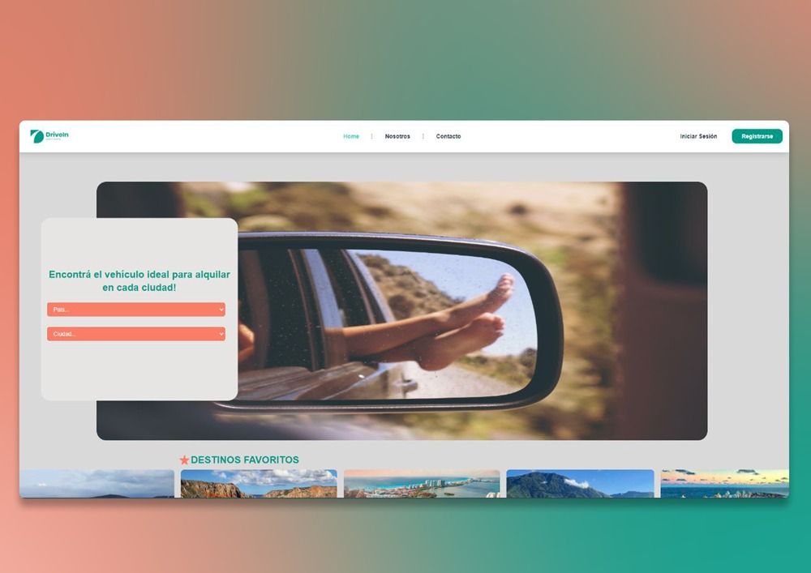
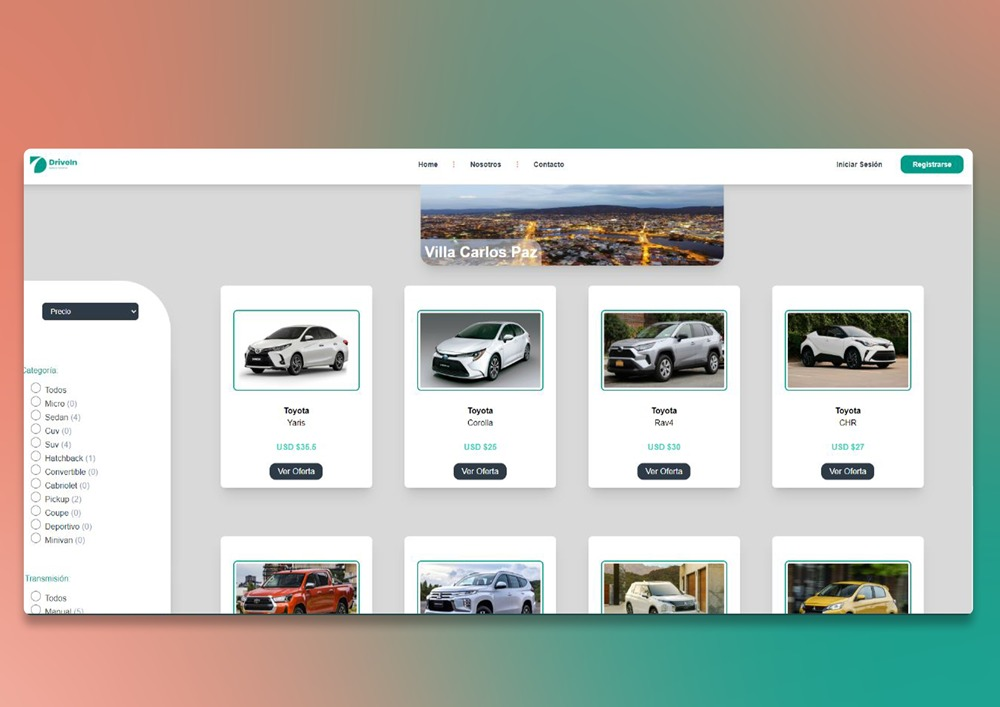
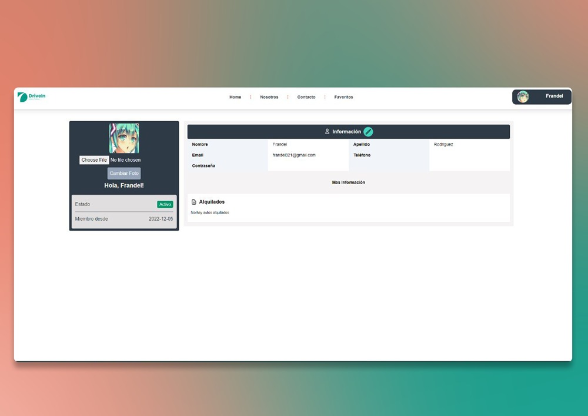
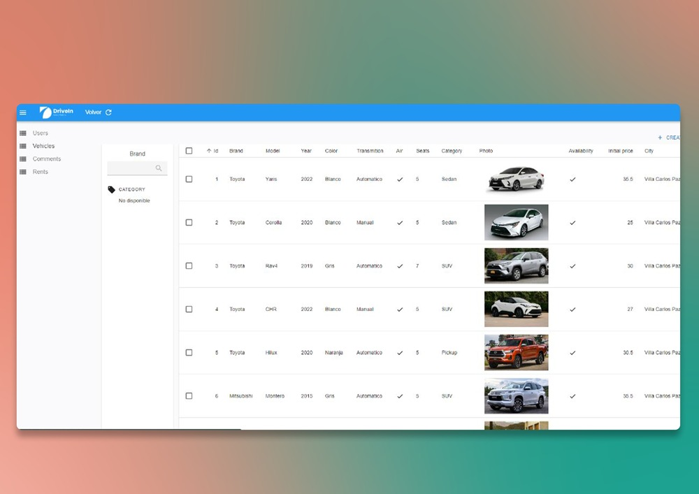

# DriveIn - Proyecto Final

  

## Resumen

El sitio web es un e-commerce que consiste en la prestación de servicios  de alquler vehículos alrededor de las principales ciudades turísticas en Latinoamérica, con el objetivo de ser utilizados para fines turísticos o cualquier otra necesidad. **De esta forma buscamos garantizar el mejor servicio de alquileres de LATAM**.

## Funcionalidades

### Como Usuario No Logeado:

-   Registrarme como usuario/cliente.
-   Elegir país y ciudad de destino.
-   Ver el Home con un catálogo de vehículos disponibles para alquilar.
-   Ver los detalles del vehículos.
-   Filtrar/ordenar los vehículos de acuerdo a las necesidades.

### Como Usuario Logeado:

-   Login/Logout con la cuenta creada localmente o con google.
-   Alquilar vehículos en base a cierta cantidad de días y adicionales.
-   Comentar y puntuar los vehículos alquilados.
-   Agregar vehículos a favoritos.
-   Poder ver los datos de perfil y modificarlos.

### Administrador

-   Ver listado completo de usuarios, vehículos, comentarios y rentas.
-   Banear/Desbanear usuarios.
-   Puedo crear/modificar/eliminar vehículos.
-   Puedo activar/desactivar rentas

## Tecnologías usadas

-   JavaScipt
-   HTML
-   Tailwind CSS
-   React.js
-   Redux
-   Cloudinary
-   Node.js
-   Express.js
-   Auth0
-   Nodemailer
-   PostgreSQL
-   SQL
-   Sequelize.js
-   React-admin
-   Stripe (pasarela de pagos)

# 💻 Capturas en Escritorio 💻

  

  

  

  

  

### <a href="https://drivein.vercel.app/">Link a la aplicación</a>

## Demo

Para probar o ver el sitio web ingresa al siguiente enlace:

-   Para visitar el sitio web [click aquí](https://drivein.vercel.app/).

-   Para ver el video explicativo del proyecto [click aquí](#).

### Simulación como administrador:

Para probar ser un administrador en la página ingresa las siguientes credenciales en la ventana de Login:

-   Usuario: admin@email.com
-   Contraseña: Administrador123

### Simular pasarela de pago:

La pasarela de pago se encuentra _en modo de prueba_ para que cualquier pueda probarle sin necesidad de gastar dinero de verdad.
Para probarla podrás utilizar los siguientes datos para simular un pago:

-   Numero de tarjeta: 4242 4242 4242 4242
-   Fecha de vencimiento: Posterior a la actual
-   CVV: 123
-   CP: 12345

En caso de querer probar una tarjeta errónea:

-   Número de tarjeta: 4000 0000 0000 0002

## Sobre nosotros

Nuestro equipo está conformado por 8 integrantes: [Juan Agustín Reynoso Mujica](https://github.com/jagustinrm), [Ariel Bravo](https://github.com/arielbg00), [Frandel Rodriguez](https://github.com/Naotari), [Javier Moyano](https://github.com/Javymoyano), [Javier Villatoro](https://github.com/Javillat), [Leonardo Fleitas](https://github.com/abfleitas), [Lucas Magra](https://github.com/luqasmagra), [Verónica González](https://github.com/verojuy). Somos un equipo con mucha química, pasión, ánimo y energía para trabajar. Dispuestos a seguir aprendiendo de otras personas y por nosotros mismos. Realizamos este sitio web como instancia del proyecto final en el bootcamp de [HENRY](https://www.soyhenry.com), afianzamos cada una de las tecnologías aprendidas en la carrera y más.

Muchas gracias por visitar nuestro proyecto.